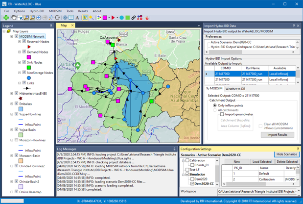

# Welcome to the WaterALLOC User Connection

### Water Resources Modeling Management System 
The original objective of this project was to develop a MODSIM-based Water Allocation Module (WaterALLOC) to be used in conjunction with the Hydro-BID modeling system, using the river basin simulation capabilities from MODSIM to enhance our river basin planning and management offerings.  The new module will allow using the hydrologic processes simulated in Hydro-BID and import them directly into MODSIM to perform simulation of water allocation and system operations, based on water use priorities, water rights, water permits, storage operation rules, and administrative and social constraints.  The new robust modeling platform will strengthen RTI’s river basin management offerings, including streamlined data management between the models, ability to simulate responses and alternatives in complex systems, evaluate water availability including priorities and operations, and evaluate impacts of climate change and benefits of adaptation measures.  

[TOC]

## Main Sections

* Introduction 
* Getting started 
* Create a new project
* Extensions and Modules
* Working with modules 
    * General setting and options 
    * Working with [HydroBID](HydroBID_Main.md) 
    * Working with [MODSIM](Modules\MODSIM\MODSIMModule.md)
    * Hydro-Economic Module
    * GSFLow Module

## Introduction

*Description of what is WaterALLOC and motivation for its development. Mutual complement of HydroBID and MODSIM*

WaterALLOC is a modeling management system that provides a new geographic information system (GIS)-based interface that streamline the data processing between **HydroBID** and **MODSIM** models, offering a solution to perform water availability analysis, including river and reservoir operations with simulation of water permits and priorities, using all the river operations tools and customization provided by MODSIM. WaterALLOC was created to enhance the user experience for both, HydroBID and MODSIM users, allowing the HydroBID user to use the GIS interface to run the system and adding easy-to-use input dialogs for agricultural and municipal demands for MODSIM. Additionally, his tool creates the MODSIM simulation network automatically from the Analytical Hydrology Dataset (**AHD**) network built for HydroBID, using the catchments and streams to define the links and nodes of the MODSIM network.

WaterALLOC links the results of local runoff from HydroBID to the entry nodes of MODSIM to simulate the routing of the flows in the streams of a basin. Georeferenced demand nodes can be created within the WaterALLOC interface to simulate water intake and consumption according to water availability at different points of the basin and in accordance with the permits, priorities, and physical and hydraulic limitations of the system. Also, WaterALLOC allows the creation and simulation of operation of reservoir systems, simulating water supply and power generation operations.

The new robust modeling platform offers a streamlined solution for data management between the models, the ability to perform comprehensive water balance analysis that includes water infrastructure operation rules, water allocation priorities, and administrative and social constraints. Additionally, the platform supports scenario management allowing the simulation and analysis of dynamic changes to land cover, water demands, population, surface and groundwater interactions, and climate.

### WaterALLOC Approach

*Provide a comparison table of the features, applications (from poster)*

WaterALLOC builds upon two existing modeling tools, **HydroBID** and **MODSIM** with the purpose of enhancing the ability and effectiveness in providing streamlined and comprehensive solutions for water resources management around the world. WaterALLOC brings together the hydrologic simulation capabilities from HydroBID and the river basin simulation capabilities from MODSIM to support water resources planning and management.

<table><thead><tr class="header"><th></th><th><strong>HydroBID</strong></th><th><strong>MODSIM</strong></th></tr></thead><tbody><tr class="odd"><td><strong>Function</strong></td><td>Rainfall-runoff processes modeling</td><td>River basin operation and planning modeling</td></tr><tr class="even"><td><strong>Description</strong></td><td>Highly scalable rainfall-runoff modeling system model based on the generalized Watershed Loading Factor (GWLF) formulation to estimate the availability of surface water (stream flows) at the regional, basin, and sub-basin scales.</td><td>Generic river basin management decision-support system capable of simulating complex, large-scale surface water networks; excels in the area of administering water in systems governed by water rights, administrative constraints, and agreements.</td></tr><tr class="odd"><td><strong>Features</strong></td><td><ul><li><blockquote>
Includes the Analytical Hydrography Dataset for Latin
</blockquote></li><li><blockquote>
America and the Caribbean (LAC AHD), a digital representation of more than 300,000 catchments with their corresponding topography, river, and stream segments
</blockquote></li><li><blockquote>
Includes a GIS-based catchments and streams navigation tool
</blockquote></li><li><blockquote>
Provides a climate data interpolation interface to obtain rainfall and temperature inputs for the area and period of interest
</blockquote></li><li><blockquote>
Includes a routing scheme for quantifying time of travel and cumulative flow estimates
</blockquote></li><li><blockquote>
Additional modules:
</blockquote><ul><li><blockquote>
Simulates the effect of climate change
</blockquote></li><li><blockquote>
Simulate the effect of reservoirs on downstream flows
</blockquote></li><li><blockquote>
Link with MODFLOW groundwater models to incorporate water exchanges between groundwater and surface water
</blockquote></li><li><blockquote>
Model sediment loads using Modified Universal Soil Loss Equations
</blockquote></li></ul></li></ul></td><td><ul><li><blockquote>
Uses linear-network structure and optimization as an efficient technique to operate the system and allocate water
</blockquote></li><li><blockquote>
Performs water allocation based on priorities or water rights
</blockquote></li><li><blockquote>
Includes features for reservoirs operation
</blockquote></li><li><blockquote>
Allows simulation of stream-aquifer interaction and operations impacts
</blockquote></li><li><blockquote>
Includes customizable pre-processing, execution, and post processing
</blockquote></li></ul></td></tr><tr class="even"><td><strong>Distribution</strong></td><td>Publicly available</td><td>Publicly available</td></tr><tr class="odd"><td><strong>Developer</strong></td><td>RTI International</td><td>Colorado State University</td></tr></tbody></table>

### WaterALLOC Key Features

-   Provides a GIS interface to visualize the catchments, streamlines, MODSIM network and results

-   Uses the AHD geo-spatial features to create the MODSIM network

-   Allows a full map of the stream network or a simplified network

-   Allows launch and run HydroBID and MODSIM from the same interface

-   Allows to perform watershed analysis (similar to the **AHD Navigation** **Tool** in QGIS)

-   Imports the output from HydroBID into the MODSIM network

-   Prepares the MODSIM network with HydroBID settings for a ready to run model

-   Allows visualizing the HydroBID output spatially in the map

-   Allows access to the MODSIM objects, functionalities, and outputs

-   Allows creating new features to complete the water allocation analysis (demands and reservoirs)

-   Provides statistical metrics and graphs to calibrate the model

-   Provides a hydro-economic module to conduct cost-benefit analysis

-   Provides a scenario management structure to address “what if” questions and develop and compare scenarios with different assumptions

## WaterALLOC Development

*RTI has provided primary support for WaterALLOC development. Provide brief description of projects where WaterALLOC has been applied.*

Since 2017, RTI has provided primary support for WaterALLOC development through Independent Research and Development (IR&D) Projects. Also, client-driven improvement and software customization has been conducted on project-based cases funded by the Inter-American Development Bank (IDB).

Since its initial development, WaterALLOC has been applied successfully in several countries in the Latin American and Caribbean Region (LAC) to simulate complex hydrological systems, to support long-term planning, and provide a framework for integrated water resources management.

<table><thead><tr class="header"><th><strong>Year</strong></th><th><strong>Country</strong></th><th><strong>Client</strong></th><th><strong>Status</strong></th><th><strong>Description</strong></th></tr></thead><tbody><tr class="odd"><td>2018</td><td>Peru</td><td>IDB Invest/ Danper S.A.C.</td><td>Completed</td><td>Assess water optimization activities for the Peruvian agro-industry company Danper S.A.C. located in Trujillo, Peru. Develop a water balance model to simulate the water supply and demand in the basins where Danper’s agricultural and industrial productions are located. Assess impact on the water balance considering water demand and climate variability to better understand the risk and vulnerability associated with Danper’s operations in the context of climate change. Provide a cost-benefit analysis on alternative technologies that can help mitigate water shortages and optimize the use of water. Identify green infrastructure measures focused on water collection and water storage that could be implemented in areas facing water security issues.</td></tr><tr class="even"><td>2018</td><td>Chile</td><td>IDB/Fundación Chile</td><td>Completed</td><td>Evaluate the impact of climate change on future water balance for the Maule basin.</td></tr><tr class="odd"><td>2019</td><td>Brazil</td><td>IDB/ ADASA/ANA/ CAESB/SEAGRI</td><td>Completed</td><td>Support the analysis of water supply planning for the Federal District (FD) by understanding and reducing its vulnerability to severe droughts, and by increasing the efficiency in the allocation of available water resources among different competing users, while providing a decision support tool for water resources management and water allocation. Illustrate the application of hydro-economic tools for determining efficient resource allocation and analyzing tradeoffs among competing water uses in a selected study area.</td></tr><tr class="even"><td>2020</td><td>Honduras</td><td>IDB/ UGASAM- SANAA/ENEE</td><td>Completed</td><td>Analyze the current and future conditions of water availability and scarcity for the city of Tegucigalpa in Honduras in a context of climate change, and to analyze potential water sources and different management strategies to reduce the current water deficit that faces the capital city.</td></tr><tr class="odd"><td>2020</td><td>Peru</td><td>IDB/SEDAPAL</td><td>Ongoing</td><td>Support the development of a system for the planning and integrated management of the basins that supply water to the Metropolitan Area of Lima (AML), which will seek to minimize the environmental, economic, and social impacts due to drought events.</td></tr><tr class="even"><td>2020</td><td>Colombia</td><td>IDB</td><td>Ongoing</td><td>Develop technical capacities and apply HydroBID and WaterALLOC management tools to support the formulation of Water Safety Plans for four water utilities under the IDB’s COMPASS program.</td></tr><tr class="odd"><td>2020</td><td>Chile</td><td>IDB</td><td>Ongoing</td><td>Support the development of a Drought Management Plan (DMP) for the Maipo basin that will pursue to minimize the environmental, economic, and social impacts of drought episodes.</td></tr><tr class="even"><td>2021</td><td>El Salvador</td><td>IDB</td><td>Coming soon</td><td></td></tr></tbody></table>

## WaterALLOC Software Installation

*Explanation of the installation files and license agreement.*

WaterALLOC is distributed at no cost to our clients. To install WaterALLOC, copy the installation files into a folder and run the installer by double clicking the **setup.exe** file and then click on Install in the prompt window.

When installation has completed successfully, you can open the program by searching for WaterALLOC in the Start menu of Windows and then clicking on the program icon .

RTI provides a free license to use the software for non-commercial purposes. The license is granted for 30 days and it is automatically renewed with an Internet connection every 30 days.

WaterALLOC runs in Microsoft Windows computers with a minimum of XX RAM capacity and an Internet connection is not required.

Note: Although it is not required to install MODSIM in your computer, several versions of MODSIM are also distributed within the program installation files. Having MODSIM installed can be useful for editing complex networks.

## HydroBID and MODSIM Modeling Tools

*Provide brief description of HydroBID and MODSIM and include links to documentation.*

To get started, we suggest getting familiarized with some key concepts about HydroBID and MODSIM:

### HydroBID

-   *AHD*

-   *COMID*

-   *Land use and soil type default databases*

-   *CDIT*

-   *Calibration parameters*

-   *Settings file*

The HydroBID modeling system for quantitative simulation of hydrology and climate change has three primary components: the **Analytical Hydrography Dataset (AHD)**, the **database**, and the **hydrologic model**.

#### AHD

The **AHD** is a digital representation of catchment boundaries and stream segments for the entire LAC region, containing over 300,000 catchments with an average size of 83 km2 for South America and 23 km2 for Central America and the Caribbean. The AHD is a regional platform of spatial data used to integrate the disparate data needed to support hydrologic modeling. It provides a framework for consistently parameterizing models, provides the necessary river network connectivity, and stores the data necessary for displaying results in a GIS format.

#### COMID

Each of the catchments and stream segments delineated in the AHD has a unique identifier number known as **COMID**, which allows to quickly identify the basins and rivers that drain at a certain point within the extension of the AHD (Add Reference to Technical Note 1).

> 

#### AHD Flow Table

HydroBID includes a table containing the upstream/downstream relationship between each stream or each catchment. The table with this information is the AHD flow table (AHDFlow.dbf). This table allows the navigation of the AHD using GIS tools.

#### Database

The **database** contains information associated with each catchment, including drainage area, stream length, slope, land uses, and soil types. Additionally, each catchment in the AHD is parametrized with land use and soil type data from global datasets. The land cover data is based on the U.S. Geological Survey (USGS) Global Land Characterization and the soil type data is based on the Harmonized World Soil Database (HWSD) supported by the International Institute for Applied Systems Analysis (IIASA) and the Food and Agriculture Organization (FAO). The catchment’s soil and land cover conditions determine the Curve Number (CN) and the hydrologic soil group that the model uses to calculate runoff. All the input data for HydroBID is stored in a single SQLite database.

> 

#### Hydrologic Model

The **hydrologic model** is an enhanced version of the rainfall-runoff Generalized Watershed Loading Function (GWLF) model (Haith and Shoemaker, 1987), coupled with a novel lag-routing methodology developed by RTI (Moreda et al., 2014). The model computes runoff and baseflow by catchment. The GWLF estimates runoff using the U.S. Soil Conservation Service’s curve number (CN) method. Catchment CNs are stored in the database and are determined by the watershed’s combination of soil and land cover conditions, which are represented as hydrologic soil groups, cover type, treatment, and hydrologic condition. After runoff estimates, excess precipitation infiltrates to the unsaturated layer where it is subject to evaporation. Over time, the infiltrated water percolates from the unsaturated layer downward to replenish the saturated storage. Water within the saturated layer enters the stream channel as baseflow where it combines with runoff from the catchment and any inflows from the upstream catchments to provide the stream flow volume, which is then routed through the stream network defined by the AHD (Add Reference to Technical Note 2).

> 

#### Climate Data Interpolation Tool 

A preprocessor referred to as the Climate Data Interpolation Tool (**CDIT**), built into the HydroBID modeling system, automates spatial interpolation of daily temperature and precipitation time series between stations. The tool uses the Inverse Distance Weighting (IDW) method to interpolate climate data at the centroid of each catchment.

#### Outputs

HydroBID can simulate stream flows in unimpaired watersheds for historic, current, and future conditions based on land use, precipitation, and temperature inputs. **Model outputs** of predicted streamflow are saved in readily usable, comma separated value (.csv) format, at either a daily or monthly time step. The system has a graphical user interface (GUI) to facilitate loading and processing of model input, as well as to display both graphical and tabulated model output.

> 

The hydrologic model utilizes the data structure and the catchment and stream network topologies of the AHD to generate flow estimates at the outlet of any catchment or basin selected by the user. In addition to flow generation, HydroBID includes other modules for 1) reservoir simulation, 2) sediment transport, and 3) surface and groundwater interactions using MODFLOW.

#### Calibration Parameters

HydroBID contains several calibration parameters that are used to adapt the model and optimize its performance simulating observed streamflows. HydroBID provides default values for some of the hydrologic parameters in the database. For instance, the database contains values for the CN and for AWC in the vadose zone. However, these parameters need to be calibrated to historical streamflow measurements by modifying a factor that multiplies the values already contained in the database. For other parameters, such as the recession (r) and seepage (s) coefficients, the user needs to enter the initial values that will be applied uniformly to all catchments within the simulated area.

#### Settings File

HydroBID saves all the setting parameters provided in the GUI into a text file (.txt). This **setting file** allows an identical re-run of the model at any time in the future. When open HydroBID, the GUI will be automatically populated with the values in the setting file, and all required data for a model run will be obtained from the current folder.

### MODSIM

*Describe the elements in MODSIM network (types of nodes, links) and Priorities.*

MODSIM, developed by the Colorado State University, is a decision-making support system that uses optimization in a stream network to help watershed managers with the analysis of water supply in the face of hydrological uncertainty and demand growth (<http://modsim.engr.colostate.edu/>). As a decision support system, MODSIM is designed for developing improved strategies for short-term water management, long-term operational planning, drought contingency planning, water rights analysis and water allocation between urban, agricultural, and environmental sectors (Labadie, 2012). The model uses the concept of flow networks to efficiently simulate complex water systems at river basin scale.

One of the advantages of MODSIM is that it can be customized for any unique basin management conditions, specialized operating rules, input data, output reports, and access to external models running concurrently with MODSIM, all without having to modify the original MODSIM source code. In addition, RTI holds a collaboration agreement to support the maintenance and development of MODSIM and provide our clients with enhanced and long-term support.

> 

Below are some of the key MODSIM capabilities. Labadie, 2012 has a complete list of the software capabilities.

#### Network Flow Optimization

The basic solver in MODSIM is a state-of-the-art network flow optimization algorithm that is more than an order of magnitude faster than solvers currently in use in other river basin modeling packages and capable of modeling extremely large-scale networks. The optimization of stream network provides an efficient way assuring allocation of flow in accordance with specified rights and priorities.

#### Data-driven Model

MODSIM maintains complete reliance on user input data and specifications for describing system features, operational requirements, and priorities, which are separated from the network modeling algorithmic structure. No a priori defined operating policies or priorities hardwired into MODSIM.

#### Long-term Planning to Real-time Operations

MODSIM is applicable to long term planning (monthly), medium term management (weekly), and short term operations (daily) in river systems.

#### Complex River Basin Configurations

Complex network topologies can be constructed, including looped and bifurcating flow paths. Network topology is graphically created by simple point and click actions on the GUI palette. In addition, georeferenced network topologies can be loaded into MODSIM from a geographic information system (GIS).

#### Reservoir Operations and Hydropower Generation

Reservoir balancing routines are included, allowing division of reservoir storage into several operational zones for controlling the spatial distribution of available storage in a river basin. Hydropower generation capacity and energy production is based on power plant efficiencies varying with discharge and head. Energy production calculations are performed, with consideration of tailwater effects and head-dependent hydraulic capacity restrictions on reservoir discharge.

#### Conjunctive Use

MODSIM includes modeling capabilities for conjunctive use of surface water and groundwater and simulation of stream-aquifer interactions. A stream aquifer model based on the USGS sdf approach is included, as well possible linkage with external groundwater models.

#### Water Rights and Storage Contracts

MODSIM is capable of directly incorporating institutional structures governing water allocation under direct flow or natural streamflow rights and seasonal storage rights and contracts, including provisions for allocating water according to specified priorities based on current river basin conditions

#### Customized MODSIM 

Users are provided access to all key variables and object classes in MODSIM, thereby allowing customization for any complex river basin operational and modeling constructs without the need for reprogramming and recompiling the MODSIM source code. Custom code can be developed for defining complex operating rules and policies, executing external modules such as water quality models, input of specialized data sets for particular applications, preparing customized model output and reports, and linking MODSIM with database management systems to provide access to timely data and forecast information for real-time river basin management.

The physical water resource systems are represented as a network of nodes, both storage (i.e., reservoirs) and non-storage (i.e., stream confluences, diversion points, ad demand locations), and links (i.e., canals, natural river reaches).

1.  ## Features and Functionalities

    1.  ### WaterALLOC GUI

*Provide description of: Main menu, Toolbar options, Map window, Legend, Configuration settings, Coordinate scaling, Log messages, Scenario analysis tree, Data entry dialogs, Results windows.*

The WaterALLOC interface consist of a **map window** to visualize the physical features of the study area and the MODSIM network elements; a **main menu** at the top, providing access to HydroBID and MODSIM functionalities; a **toolbar menu** that provides one-click access to various GIS and other program functions; a **log messages window** that records all the actions performed by the user and also shows error messages; a **configuration** **settings window** that is used to set the configurations of a WaterALLOC project and allows access to scenario management and view; and a **layer explorer panel** shown in the left side of the interface that allows to hide/show all layers available and to customize their properties.

-   **Main Menu:** The main menu provides access to the most important functions of WaterALLOC.

-   **File:** Allows to create a new WaterALLOC project, open an existing project, and save changes made to a project.

-   **Options**: Allows to switch between English and Spanish languages and to activate WaterALLOC modules, such as the [hydro-economic module](#hydro-economics-module).

-   **View**: Allows to activate the different windows of the WaterALLOC interface.

-   **HydroBID**: Allows to access the [HydroBID simulation](#hydrobid-simulation-1) to set the configurations of the model run (i.e., sqlite, climate data, observed streamflow files, calibration parameters, etc.) and view the results. Also, allows access to the [create MODSIM network](#create-modsim-network) and [import HydroBID output](#import-hydrobid-output) windows.

-   **MODSIM**: Allows access to MODSIM network settings and to run the model.

-   **Tools**: Allows to import a layer from a comma separated value (.csv) file.

-   **About**: Includes the license agreement and the WaterALLOC version.

<!-- -->

-   **Toolbar Menu:** The toolbar menu provides access to some GIS functions and MODSIM available elements.

> 

<table><thead><tr class="header"><th><strong>This Icon</strong></th><th><strong>Is Used to:</strong></th></tr></thead><tbody><tr class="odd"><td></td><td>Add layers to the map</td></tr><tr class="even"><td></td><td>Move the map to progressively display adjacent areas</td></tr><tr class="odd"><td></td><td>Select objects displayed in the map window. To select an object, make sure to select the layer in the Layer Explorer Panel on the left.</td></tr><tr class="even"><td></td><td>Zoom in the map</td></tr><tr class="odd"><td></td><td>Zoom out the map</td></tr><tr class="even"><td></td><td>Zoom to the previous extent</td></tr><tr class="odd"><td></td><td>Zoom to the next extent</td></tr><tr class="even"><td></td><td>Zoom to maximum extent</td></tr><tr class="odd"><td></td><td>Zoom to coordinates</td></tr><tr class="even"><td></td><td>Identifies features of the selected object in the map</td></tr><tr class="odd"><td></td><td>Show the attribute table of selected layer. Also allows to query the selection of features</td></tr><tr class="even"><td></td><td>Select label</td></tr><tr class="odd"><td></td><td>Enable/disable basemap</td></tr><tr class="even"><td></td><td>Select local inflows</td></tr><tr class="odd"><td></td><td>Enable/disable MODSIM layers</td></tr><tr class="even"><td></td><td>Demand Node. Add consumptive demands (i.e., agricultural, domestic, groundwater pumping). Demand nodes can also be added by importing a shapefile or a .csv file</td></tr><tr class="odd"><td></td><td>Reservoir Node. Add reservoirs for modeling reservoir storage operations and hydropower generation</td></tr><tr class="even"><td></td><td>Nonstorage Node. Simulate catchment runoff, which are imported from the outputs of HydroBID. Add tributary inflows, water transfers, groundwater return flows</td></tr><tr class="odd"><td></td><td>Sink Node. Basin outlet</td></tr><tr class="even"><td></td><td>Link. Add maximum and minimum flow, stream channel losses</td></tr><tr class="odd"><td></td><td>Remove MODSIM nodes and links</td></tr><tr class="even"><td></td><td>Stop editing mode</td></tr></tbody></table>

-   **Configuration Settings Window:** The settings window provides the absolute or relative paths to the configuration files of a WaterALLOC project and scenarios. It is divided in three main tabs:

    -   *General* tab shows the absolute path to the workspace and allows to select the flowline layer.

    -   *Hydro-BID* tab shows the relative paths to the HydroBID .jar (executable) file, the [AHD Flow table](#ahd-flow-table), and to the [settings file](#settings-file).

> **Note**: When creating a WaterALLOC project (.waprj), a HydroBID folder is automatically created in the same workspace, which includes HydroBID executables and a **WALLOCFiles** subfolder that organizes outputs files of HydroBID runs for different scenarios. Also, a folder for the Default scenario and its respective settings file is automatically created.
>
> 

-   *MODSIM* tab allows access to an existing MODSIM network file or allows to create a new .xy file. It also allows to modify the coordinate scaling factors, which are used to adjust the MODSIM network to the GIS interface.

The configuration settings window also allows to hide/show the scenarios management panel. See [Section 6](#scenarios-management) for more information about the scenario management.

-   **Layer Explorer Panel:** All layers added to a WaterALLOC project will be displayed in the layer panel on the left. The panel helps manage the display order of map layers and their symbology and set other properties of each map layer. Layers listed at the top are displayed first, followed by the layers below them. A layer’s attribute information can be accessed by clicking the attribute table icon ( ) or the Identifier icon () in the toolbar menu. When creating a WaterALLOc project, the MODSIM Network layers and the Online Basemap are automatically loaded to the panel. These layers should not be removed. Use the check box to the left of each layer to turn it on or off. Right-click on the layer to zoom to layer, export all or selected features, set labels, and access the Properties dialog window to change the symbology.

### HydroBID Simulation

HydroBID is a stand alone program written in Java, but can be launched and run through the WaterALLOC GUI…..

1.  #### HydroBID folder

2.  #### Set inflow points

-   *WaterALLOC allows to set inflow points through the GIS interface. Explain and provide an example of what runoff is represented at each node.*

#### HydroBID simulation

-   *Describe the watershed analysis feature*

-   *Inflow points file generated by WaterALLOC*

-   *Measure flow file*

-   *Run options*

-   *Difference between “Launch GUI” and “Execute”*

-   *Review of output folder for HydroBID simulations*

1.  ### Create MODSIM network

    -   *Explain the difference between creating a MODSIM network with “Only inflow points” vs “All catchments” and when is best to use each of these options.*

    -   *Explain when to use the “Append to existing network” and what would be overwritten if re-generated.*

2.  ### Import HydroBID output

    -   *Explain what results are available to be imported (this is tied to the active scenario).*

    -   *Explain what type of results are imported when running HydroBID with inflow points vs. all catchments.*

    -   *Explain the “Import groundwater seepage” feature.*

    -   *Describe what weather variables are imported to the WaterALLOC database and how the user can import different set of weather variables for each scenario and for all or selected COMIDs.*

    -   *Describe what output variables can be imported for spatial display*

    -   *Describe the default preferences set in MODSIM when HydroBID outputs are imported.*

3.  ### MODSIM Module

    1.  #### Creating MODSIM Networks

> There are different ways to create MODSIM networks to work with WaterALLOC: (1) using the HydroBiD AHD, (2) using a shapefile with unique identifiers, and (3) loading a previously created MODSIM network.

#### Using a Shapefile

-   General requirements

    -   Unique ID field (e.g., COMID)

    -   Drainage Area

The drainage area information is stored in the project database in a table called “wateralloc\_runoffSupp”. This table is associated with each scenario and contains the MODSIM GUID associated with the element originally created and the associated drainage area.

#### Set MODSIM elements

-   Demands through WaterALLOC data entry dialogs

    -   Domestic

        -   Explain basic data requirements

        -   Explain theory and methods to calculate domestic demands using data input through WaterALLOC dialogs

        -   With hydrologic states

    -   Agriculture

        -   Explain basic data requirements

        -   Explain difference between “user defined” and “crop based”. Describe the default values distributed with WaterALLOC and how user can change or import more

        -   Use of precipitation for net irrigation requirement

        -   Explain theory and methods to calculate agriculture demands using data input through WaterALLOC dialogs

        -   With hydrologic states

-   Other options to add demands

    -   Provide a brief explanation and link to MODSIM documentation

-   Explain the feature “Set demands from waterALLOC demands table” and when to use it

-   Explain the feature “Re-calculate all demands from Sqlite DB” and when to use it

-   Reservoirs

    -   Explain basic data requirements

-   Other water supply (Nonstorage nodes not included in the AHD)

-   Delete MODSIM elements

#### Set priorities

-   Provide a brief explanation of how priorities work in MODSIM. Provide an example and links to MODSIM documentation.

#### Run MODSIM

-   Explain how to adjust network settings

-   Explain the difference between Standard run and Hydroeconomics run

### Hydro-economics Module

-   Provide intro to this module and general capabilities. Use Brasilia report to extract information.

    1.  #### Agricultural sector

    -   Provide explanation of the theory and equations used to calculate economic benefits for agricultural sector

    -   Explain user input requirements through the WaterALLOC dialogs

    1.  #### Municipal sector

    -   Provide explanation of the theory and equations used to calculate economic benefits for municipal sector

    -   Explain user input requirements through the WaterALLOC dialogs

    1.  #### Hydropower sector

    -   Provide explanation of the theory and equations used to calculate economic benefits for hydropower sector

    1.  #### Cost-benefit analysis

    -   Explain how the CBA is performed in WaterALLOC

    -   Explain all elements and components of the economic summary dashboard

    1.  ### Operation Optimization Module

-   Provide intro to this module and general capabilities. Place holder for now.

## Scenarios Management

-   Allows set of multiple scenarios for “what if” simulations.

    -   Variables that are associated with scenarios

        -   MODSIM file

        -   HydroBID Settings file

        -   Flow Line Layer
    
    [Scenarios Data Management](WaterALLOC/) 

-   Describe the new scenario options

    -   Independent with no data

    -   Independent with snapshot of the seed

    -   Dependent of the seed

> Note: The *Flow Line Layer* for the new scenario is selected based on the MODISM file base scenario.

## Output Visualization

-   Explain the different options to explore results (graphs and tables). Provide link to MODSIM documentation.

-   Explain the option to compare measured vs. simulated flows and statistical metrics to calibrate the models.

1.  ## References

2.  ## Help & FAQ

3.  ## Contact US

Appendix A

# Project Database

The WaterALLOC project file (\*.waprj) is an database in SQLite format. The database stores information related to:

-   Project Info Data

-   Scenarios Info

-   Scenarios Demand Variables

-   HydroBID imported timeseries variables

-   MMS Info

The main database tables in the project database are referenced in
